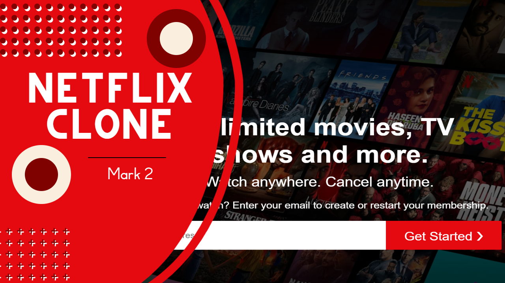

# Netflix Clone



## Description

Introducing our Netflix clone website! Built using HTML, CSS, and Javascript, this platform offers a seamless streaming experience. Enjoy a vast library of movies and TV shows, personalized recommendations, and user-friendly interface. Dive into the world of entertainment and binge-watch your favorite content at your convenience.

## Technologies Used

- HTML (Hypertext Markup Language): The standard markup language for creating web pages and web applications.
- CSS (Cascading Style Sheets): A styling language used to control the presentation and design of web pages.
- JavaScript: A versatile and widely-used programming language for web development.

## Getting Started

To run the Netflix Clone locally, follow these steps:

1. Clone the repository to your local machine:

   ```bash
   git clone https://github.com/yourusername/netflix-clone.git
   ```
